2.2 **创建导入到UE的骨骼**（参考 2.blend）

&nbsp;

关掉轴向，切换 骨骼图层 到 形变骨 层，显示 骨骼名字。

1：Root骨 图层

2：形变骨 图层

如果给导入到UE的骨骼增加 Root 骨 就选中1和2，如果不增加 Root 骨 就只选中2。

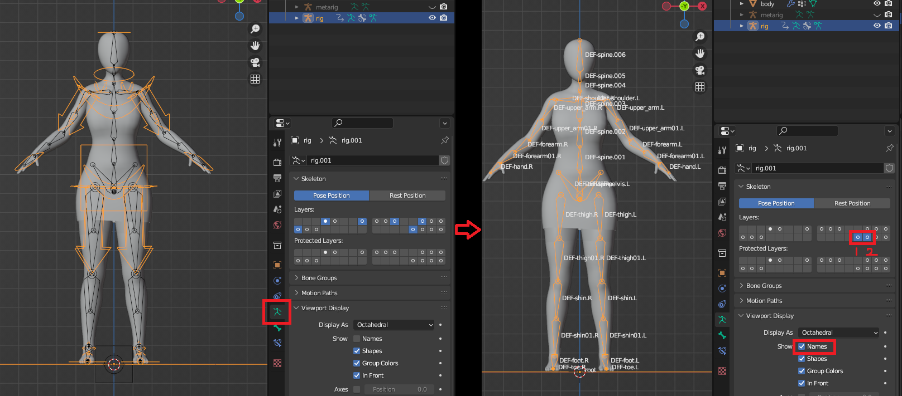

&nbsp;

&nbsp;

切换到编辑模式，按 `A` 全选骨骼 按 `Shift+D` 复制，按 `G X+120`移动到右侧。

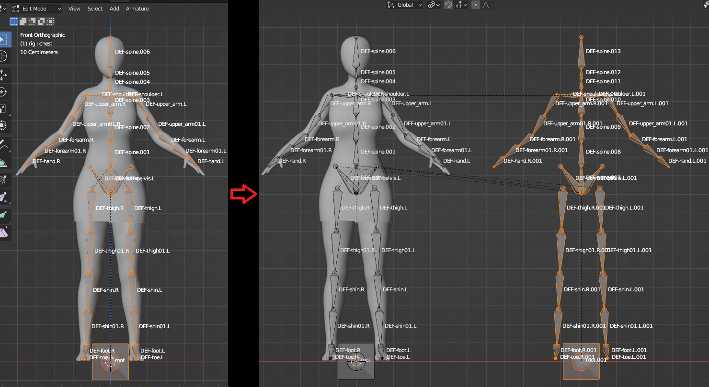

&nbsp;

&nbsp;

按 `P` 分离骨骼，切换为物体模式，

如果增加 **Root** 骨 则重命名为 **Armature** ，

如果不加就命名为 **Root** 。

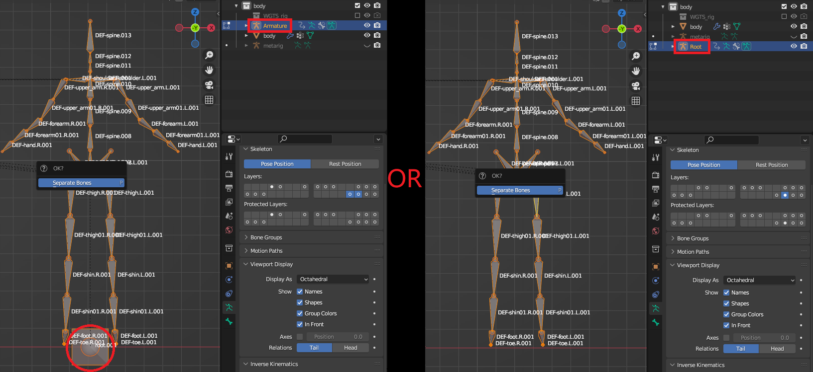

&nbsp;

&nbsp;

切换到 编辑模式，全部修改成左边骨骼的名字。

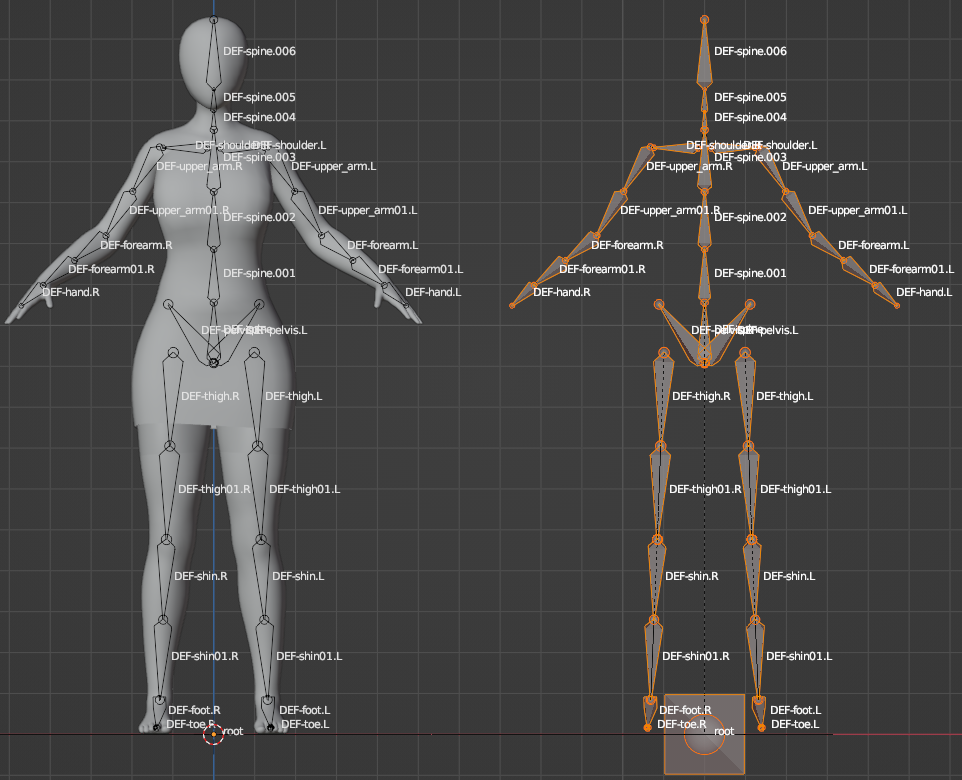

&nbsp;

&nbsp;

按 `A` 全选骨骼，按 `G X  -120` 恢复到默认位置。

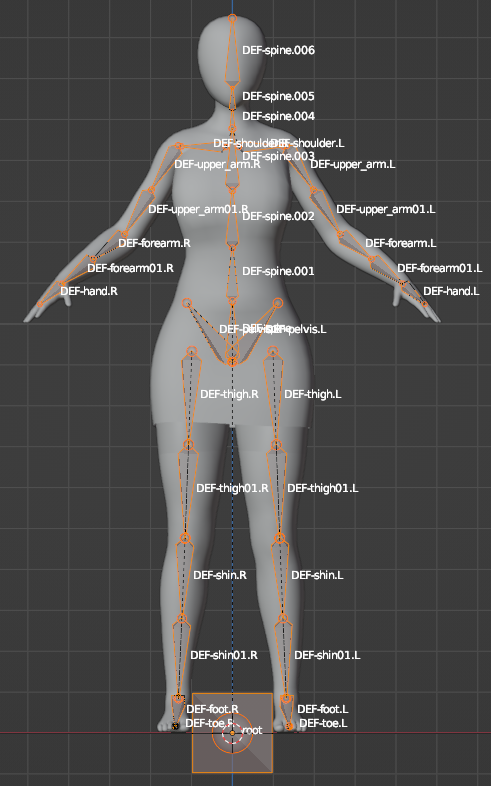

&nbsp;

&nbsp;

切换到物体模式，按 `Shift+H` 独立显示 **Armature** 骨骼。

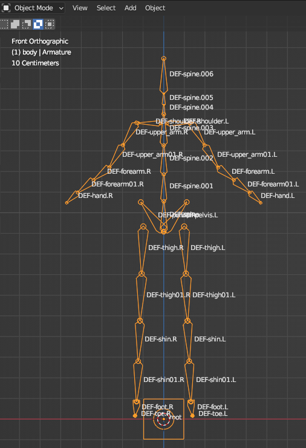

&nbsp;

* * *

&nbsp;

&nbsp;

切换到编辑模式，`Shift+D` 复制这两个骨骼,重命名为 **IK01.L** 和 **IK02.L**

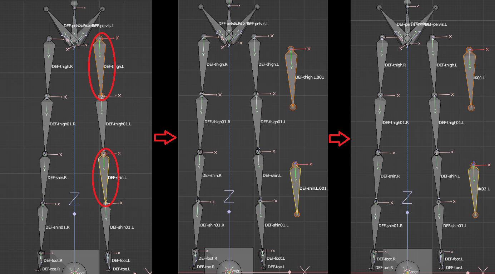

&nbsp;

&nbsp;

选中大腿骨的头部，`Shift+S` 将 游标 移动到 选中项。

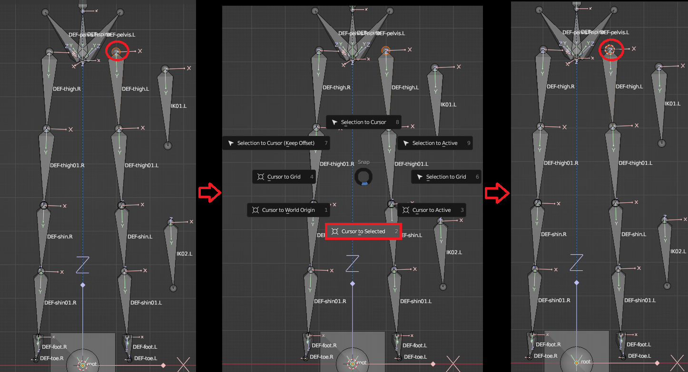

&nbsp;

&nbsp;

选中 **IK01.L** 骨的头部，`Shift+S` 将 选中项 移动到 游标。

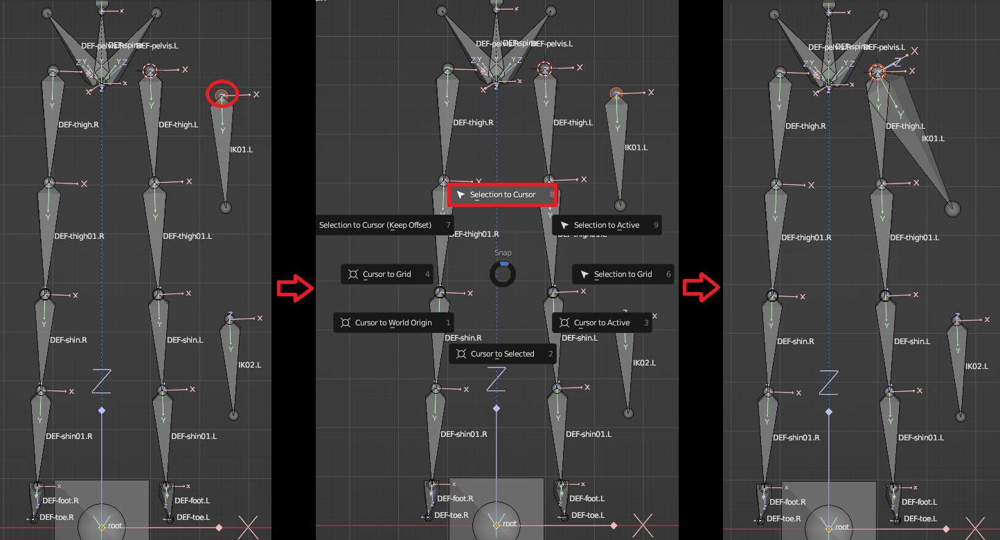

&nbsp;

&nbsp;

按同样的操作移动到下图所展示的位置。

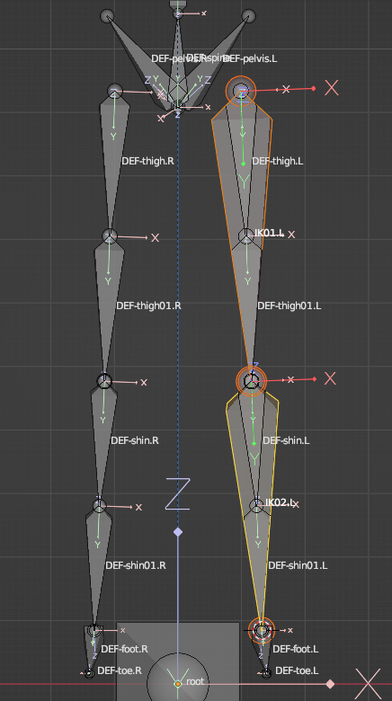

&nbsp;

&nbsp;

选择 **Foot.L** 和 **IK02.L** 按 **Ctrl+P** 将两个骨骼相连，再将 **IK02.L** 和 **IK01.L** 相连。

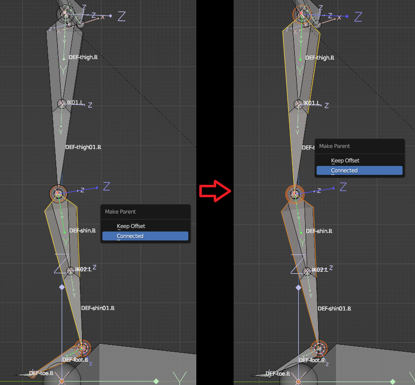

&nbsp;

&nbsp;

选择 **Foot.L  IK02.L  IK01.L** 右键 对称。

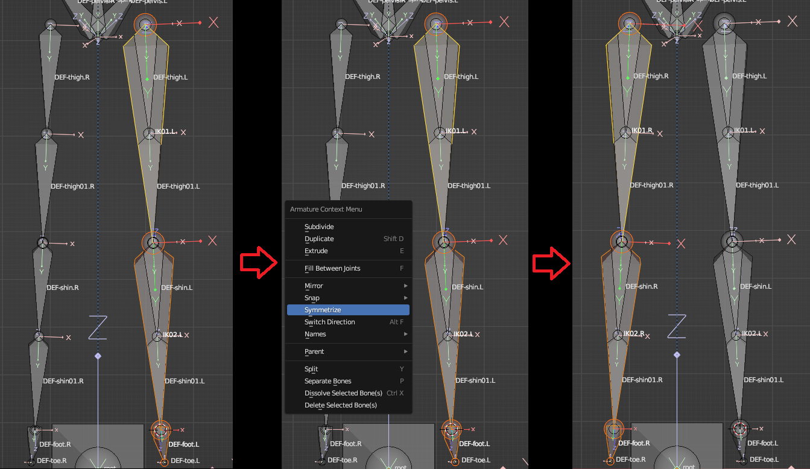

&nbsp;

&nbsp;

将 **thigh.L  thigh01.L**  的父级设置为 **IK01.L**。

**shin.L  shin01.L**  的父级设置为 **IK02.L**，给右侧做同样的设置。

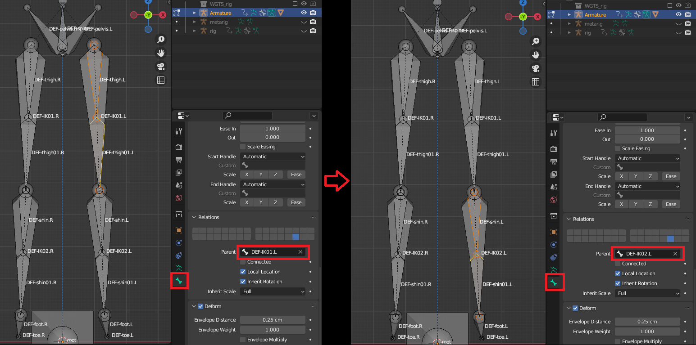

&nbsp;

&nbsp;

按次序选择 **IK01.R  IK01.L  spine**  按 `Ctrl+P` 保持偏移。

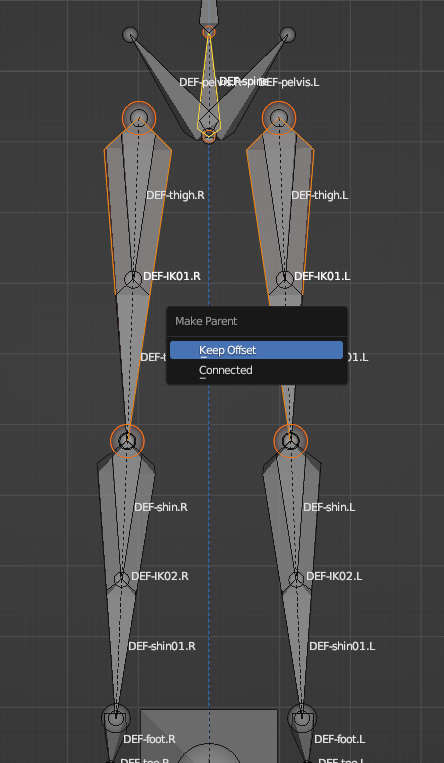

&nbsp;

&nbsp;

切换到 姿势模式，给 骨骼 添加 骨骼约束-复制变换，目标 **Rig**，骨骼选择相同的名字，除了IK骨 给所有骨骼做相同的操作。

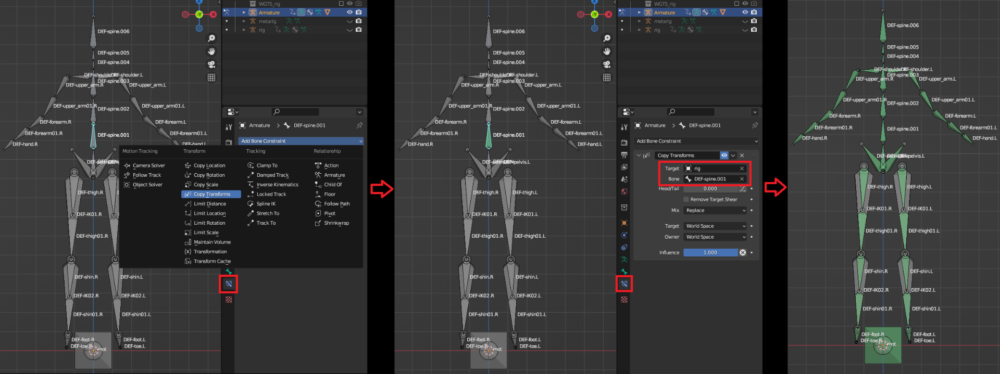

&nbsp;

&nbsp;

给 **IK01.L  IK02.L** 添加 复制变换，给右侧做同样的操作。

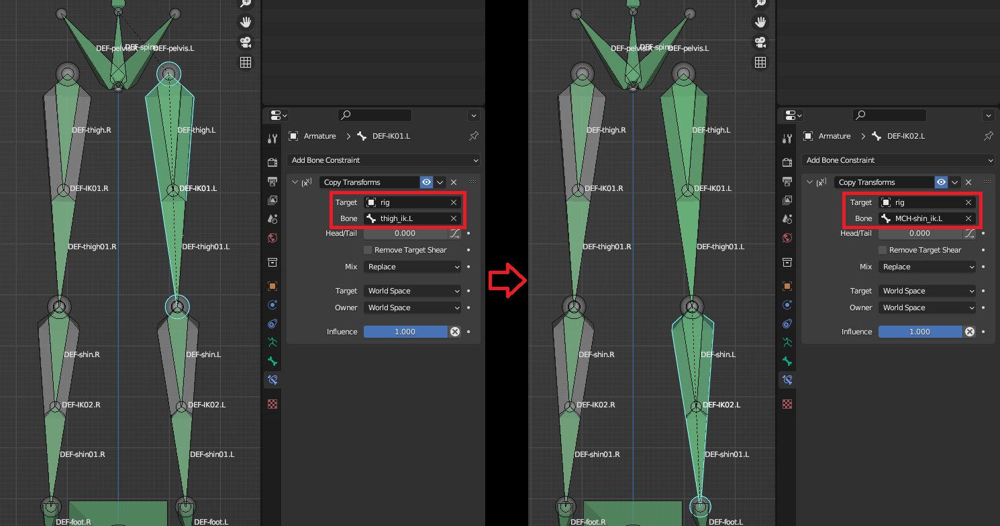

&nbsp;

* * *

&nbsp;

&nbsp;

回到 物体模式 `Alt+H` 显示全部物体，选择 角色 和 **Armature** 骨骼，按 `Ctrl+P` 选择 自动权重。

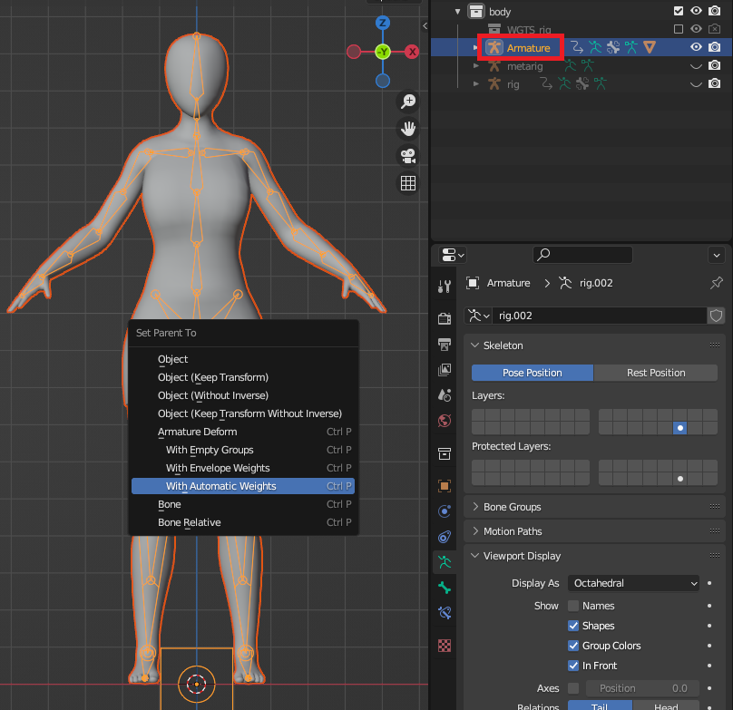

&nbsp;

&nbsp;

选择 **Rig** 骨骼，恢复 控制器 图层。进入 姿势模式 测试你的绑定。

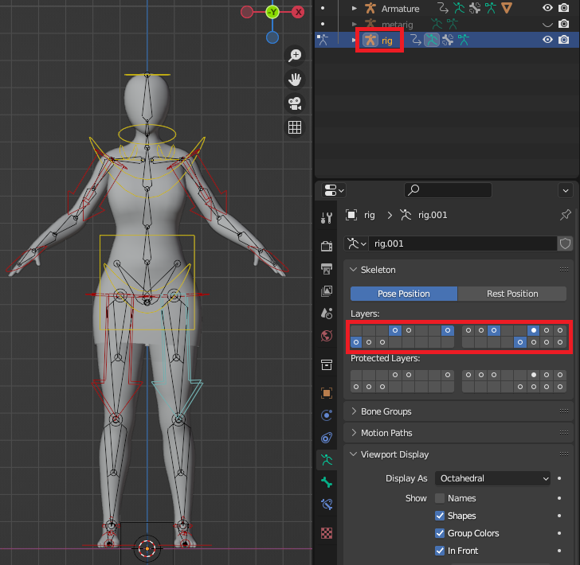

&nbsp;