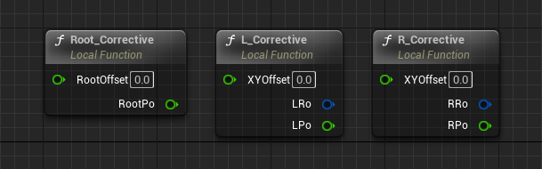
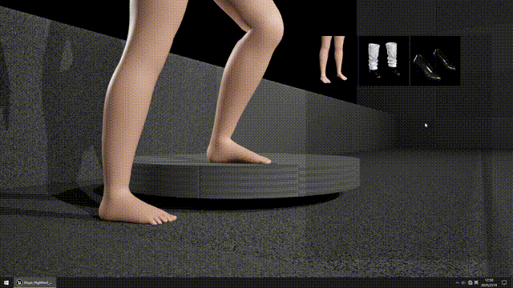

1.  1 **功能介绍**

&nbsp;

**Slope HighHeel IK** 是基于 **UE5.3 Control Rig** 的功能扩展，使用补偿算法实现不同高度的高跟鞋在 **0° - 25°** 斜坡上的鞋底贴合功能，你可以在 **Fab** 上获取到。（审核通过后会加上链接）

&nbsp;

* * *

&nbsp;

项目里自带3种状态展示：

- 光脚
- 平底鞋
- 高跟鞋

&nbsp;

&nbsp;

* * *

&nbsp;

**!当前限制**：仅适用于平坦地面和平坦的斜坡上，包括台阶，不同角度会有微量误差。

&nbsp;