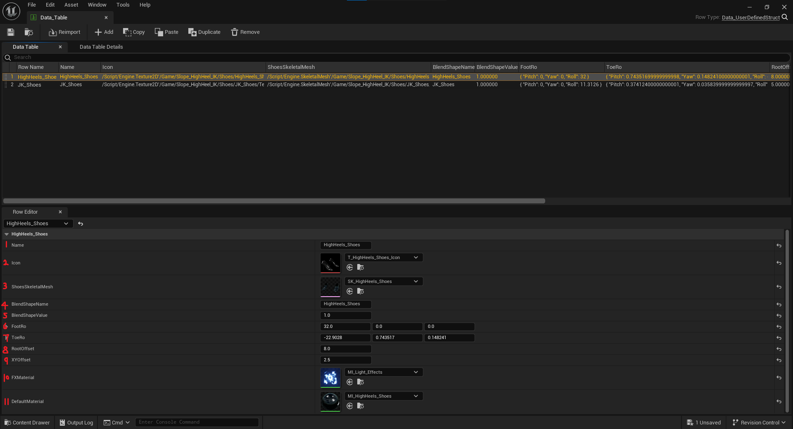
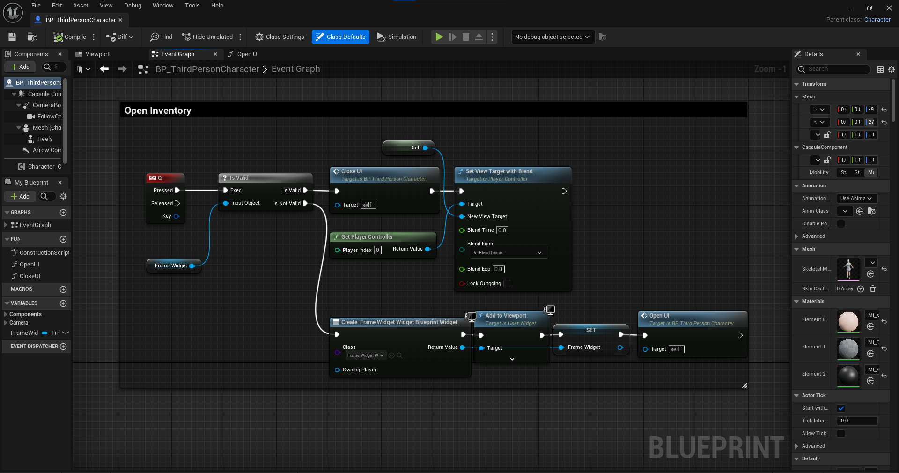
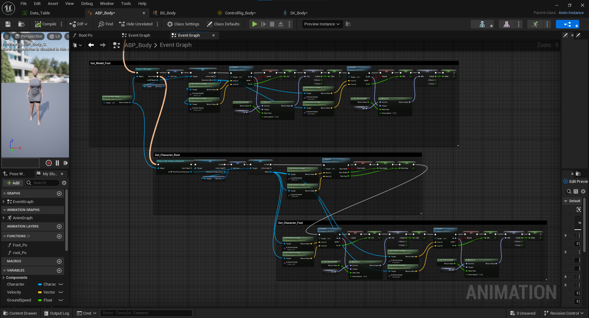
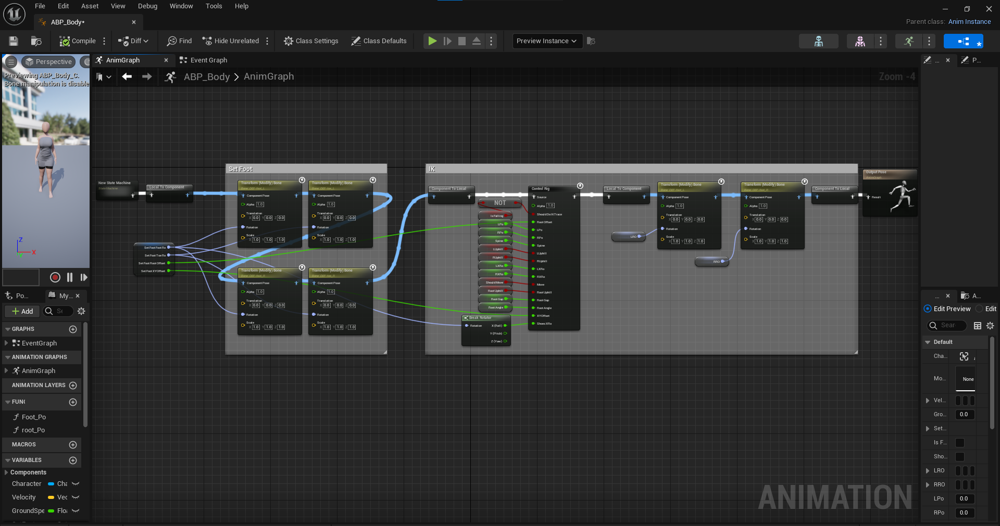
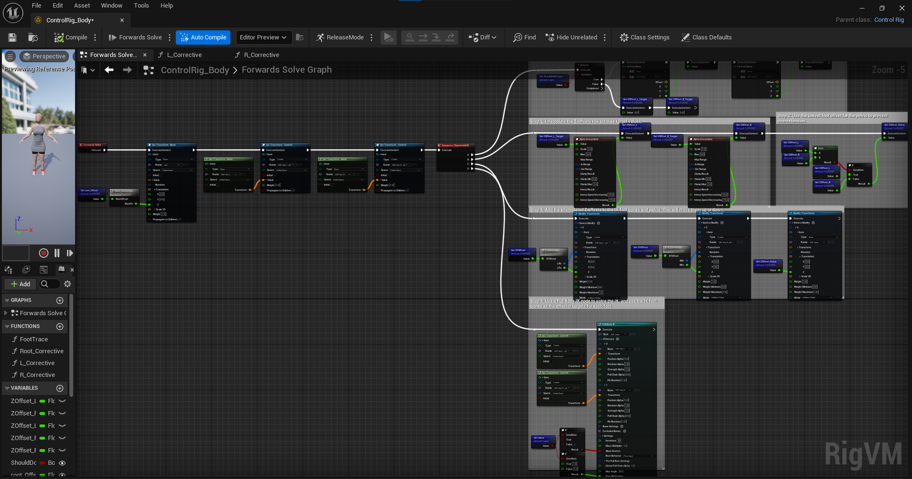
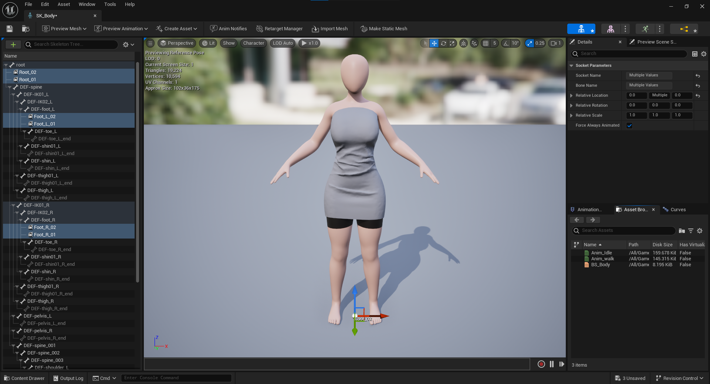
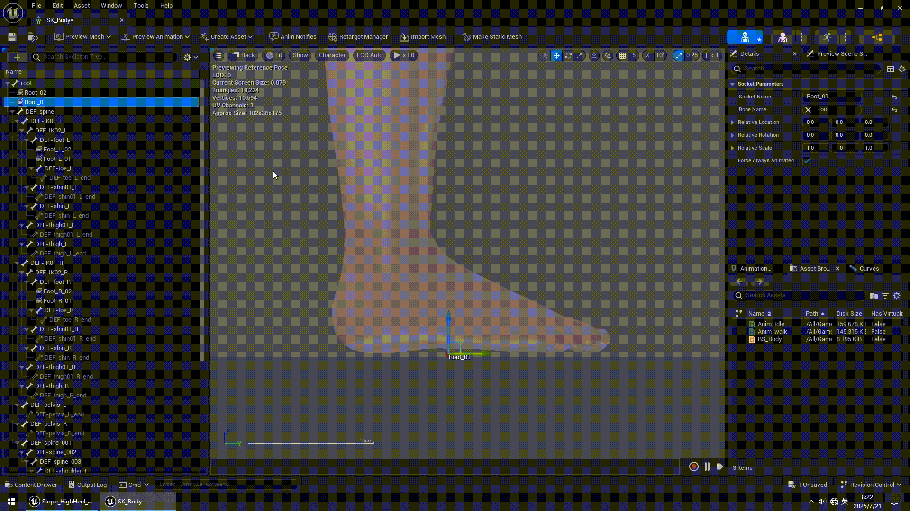
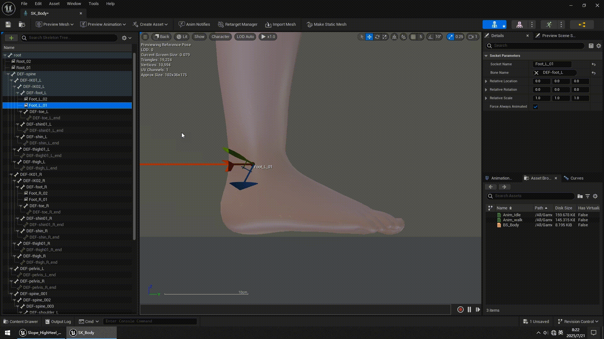
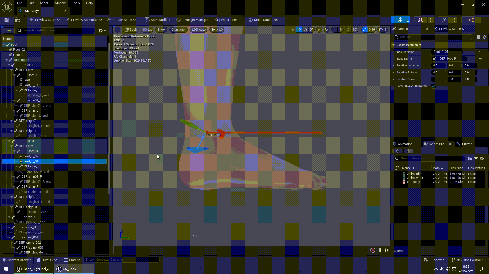

1.  2 **依赖项**

&nbsp;

补偿算法依赖这些前置条件，需要将这些内容合并到自己的项目里。

&nbsp;

1\. **Name**：鞋的名字。

2\. **Icon**：鞋的图标。

3\. **ShoesSkeletaMesh**：带骨骼的鞋模型。

4\. **BlendShapeName**：角色脚部的形态键，用来适配鞋的形状。

5\. **BlendShapeValue**：用来切换形态键的开关状态，1是开，0是关。

6\. **FootRo**：穿鞋时脚部骨骼的旋转值。

7\. **ToeRo**：穿鞋时脚趾骨骼的旋转值。

8\. **RootOffset**：脚与地面的距离。

9\. **XYOffset**：站在正坡与侧坡时脚的高度补偿。

10\. **FXMaterial**：换鞋光效，通常不需要，按你喜好取舍。

11\. **DefaultMaterial**：鞋的默认材质。

&nbsp;

* * *

&nbsp;

&nbsp;

&nbsp;

* * *

&nbsp;

&nbsp;

&nbsp;

在**Root**，**Foot_L**，**Foot_R**，每个骨骼分别创建两个插槽，前后插槽位置在 Y轴 间隔 0.5，用来进行射线检测。

&nbsp;

&nbsp;