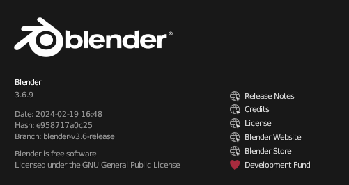
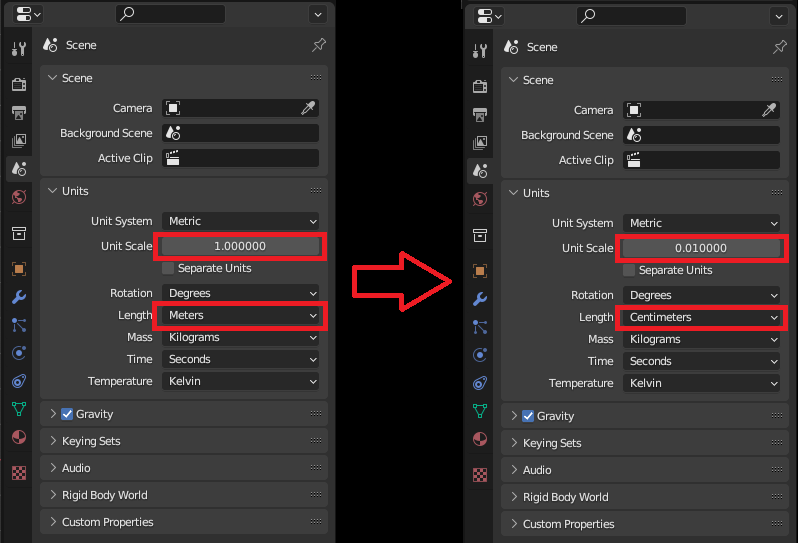
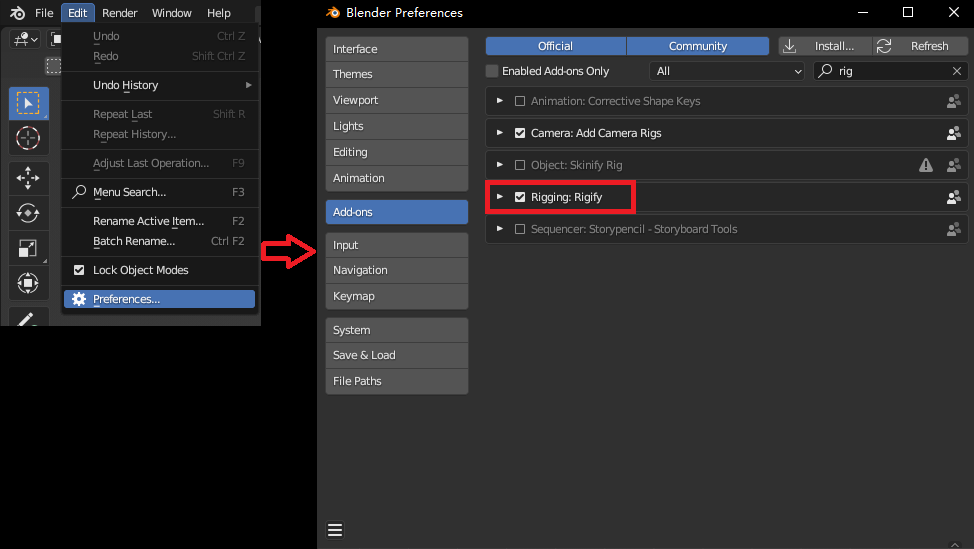
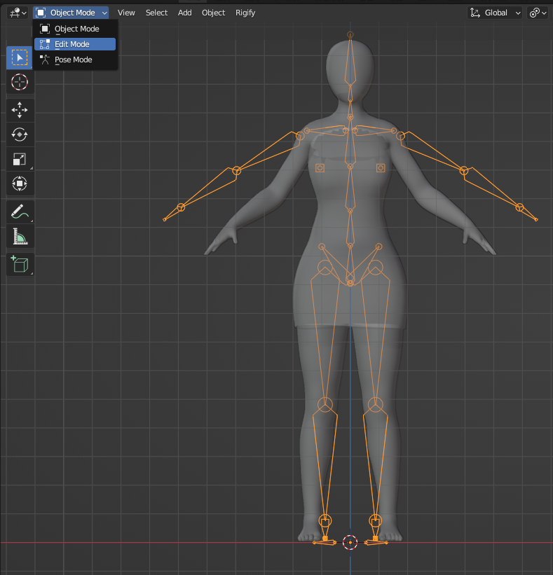

2.1 **骨骼与控制器**（参考 1.blend）

本章全部内容仅用于练习工作流，点击下载练习文件 https://github.com/GetRTX9090/Practice-files-Chinese-language/archive/refs/heads/main.zip

&nbsp;

我用的是 blender3.6.9，你可以选择自己熟悉的DCC软件，原理都是相同的。

&nbsp;

导入 **body.obj**

&nbsp;

修改世界比例

&nbsp;

* * *

&nbsp;

启用 **Rigify** 插件

&nbsp;

右键添加骨骼，为了不让文档变得太复杂我创建的是 **Basic Human** 骨骼，没有包含 手指 和 面部。

&nbsp;

把骨骼放大，对其到肩膀，启用透视。

&nbsp;

选中 骨骼 切换到 编辑模式。

&nbsp;

显示轴向。

&nbsp;

调整每块 骨头 到合适姿势。

&nbsp;

&nbsp;

脚骨参考

&nbsp;

&nbsp;

切换回 物体模式，选中 **metarig** 骨骼 点击 **Generate Rig**。

&nbsp;