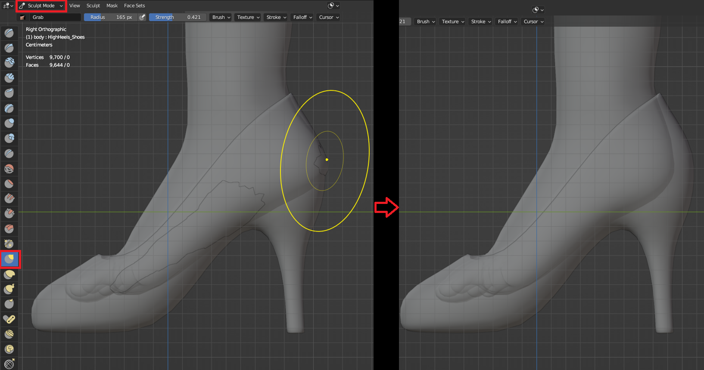

2.4 **形态键**（参考 4.blend，5.blend）

&nbsp;

导入鞋模型。

&nbsp;

移动到合适位置。

&nbsp;

* * *

&nbsp;

&nbsp;

选择 **Rig** 骨骼，进入 姿态模式，选择 **Foot** 和 **Toe** 控制器。

&nbsp;

&nbsp;

切换到欧拉旋转。

&nbsp;

&nbsp;

旋转 **Foot** 控制器。

创建资产阶段 **Foot** 的 X轴 旋转角度不能超过**33°**，**Slope HighHeel IK** 的检测机制 只支持 ****0° - 33°**** 的 **Foot** X轴 旋转值，如果你想制作旋转角度更大的高跟鞋，可以使用 雕刻模式 调整脚部模型，使其贴合鞋的角度。

&nbsp;

&nbsp;

旋转 **Toe** 控制器。

&nbsp;

&nbsp;

给角色添加 形态键。0是关闭，1是打开。

&nbsp;

&nbsp;

进入 雕刻模式，用笔刷把漏在外面的皮肤往里推，如果在UE里做极限姿势穿模，就回来继续推。

&nbsp;

* * *

&nbsp;

其他鞋 原理相同。

&nbsp;