2.6 **导出鞋**（参考 7.blend，8.blend）

&nbsp;

选择 **Rig** 骨骼 进入 姿态模式。

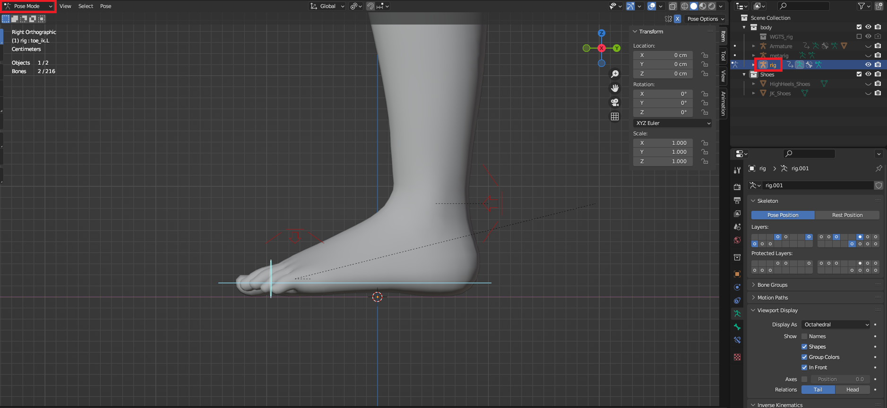

&nbsp;

&nbsp;

设置 **Foot.L**，**Foot.R**，**Toe.L**，**Toe.R**，数值。

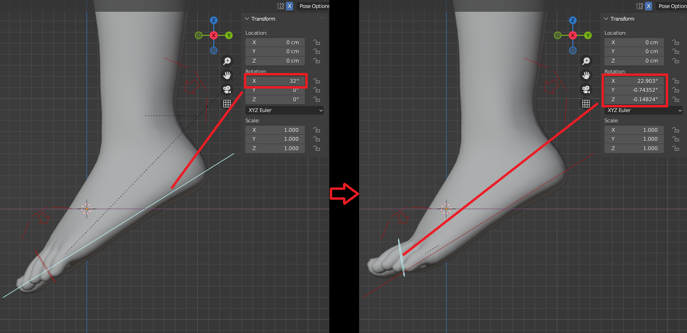

&nbsp;

&nbsp;

返回 物体模式，给角色 应用所有形态键。

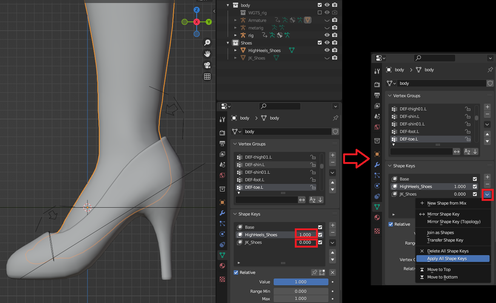

&nbsp;

&nbsp;

返回物体模式，选择角色模型，应用 骨骼修改器。

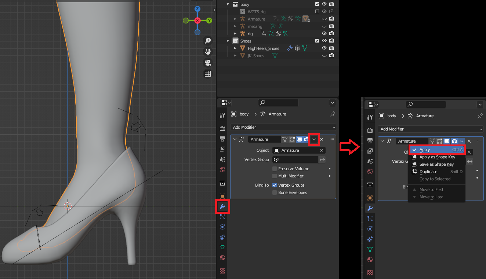

&nbsp;

&nbsp;

添加新的 骨骼修改器。

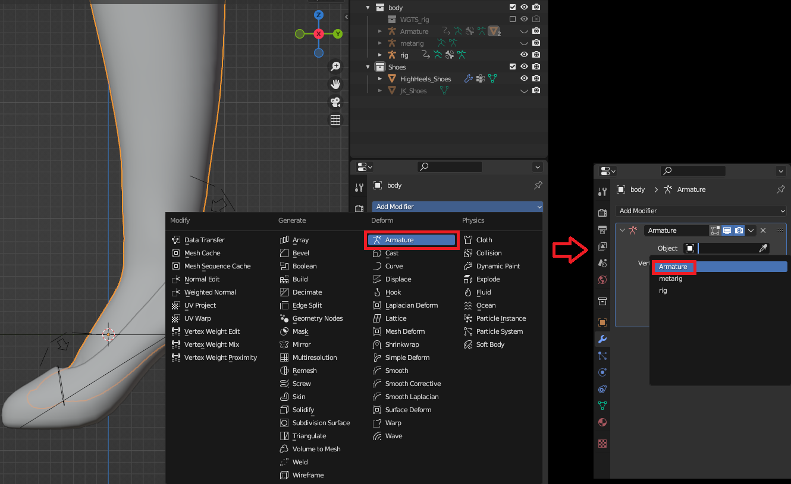

&nbsp;

&nbsp;

选择 **Armature** 骨骼，进入 姿态模式。`A` 全选骨骼 `Ctrl+A` 应用姿态。

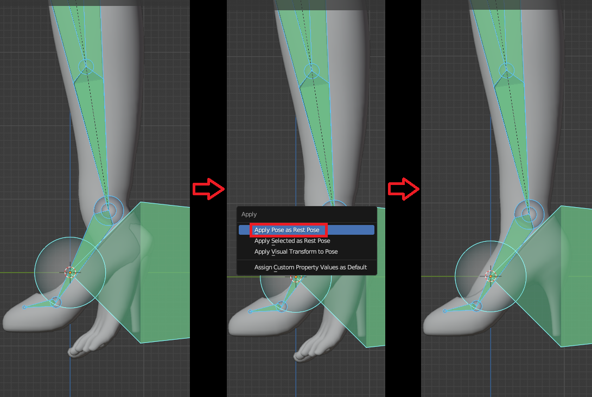

&nbsp;

* * *

&nbsp;

&nbsp;

返回物体模式，先选择 鞋 再选择 **Armature** 骨骼，`Ctrl+P` 选择 空顶点组。

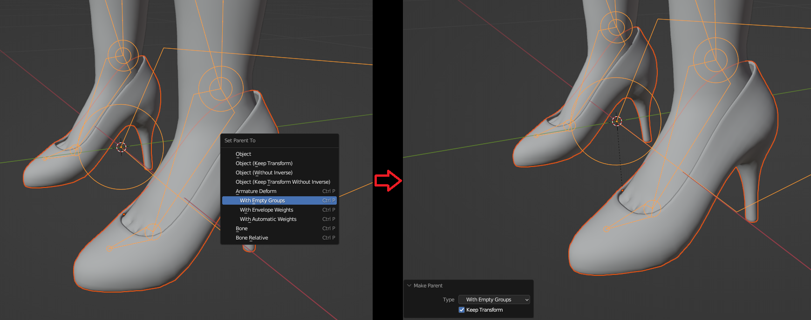

&nbsp;

&nbsp;

先选择 角色，再选择 鞋，进入 权重绘制。

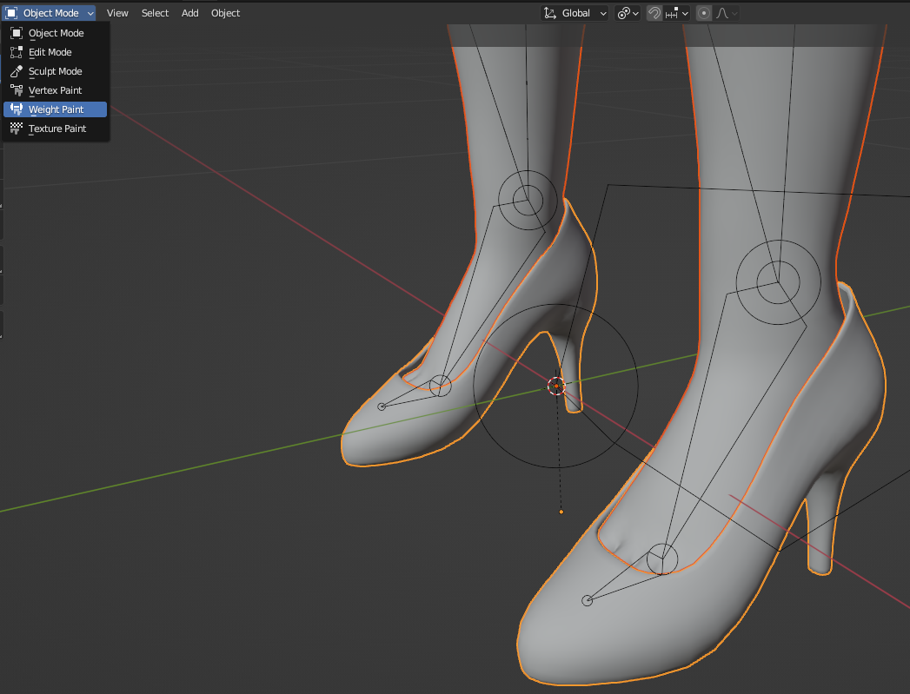

&nbsp;

&nbsp;

传递权重。

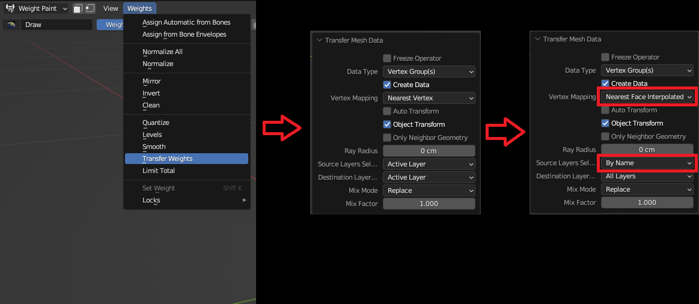

&nbsp;

&nbsp;

选择 鞋 和 **Armature** 骨骼，导出 骨骼网格体。

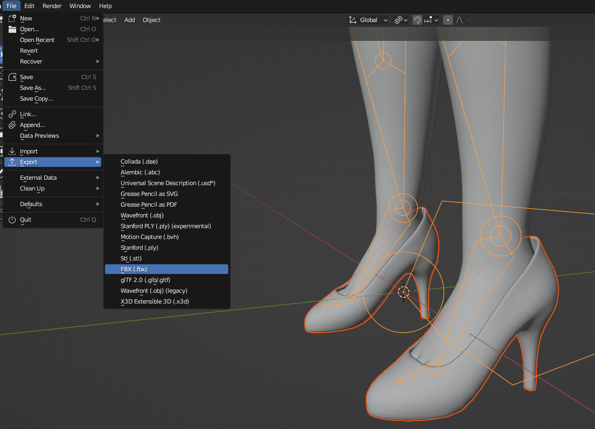

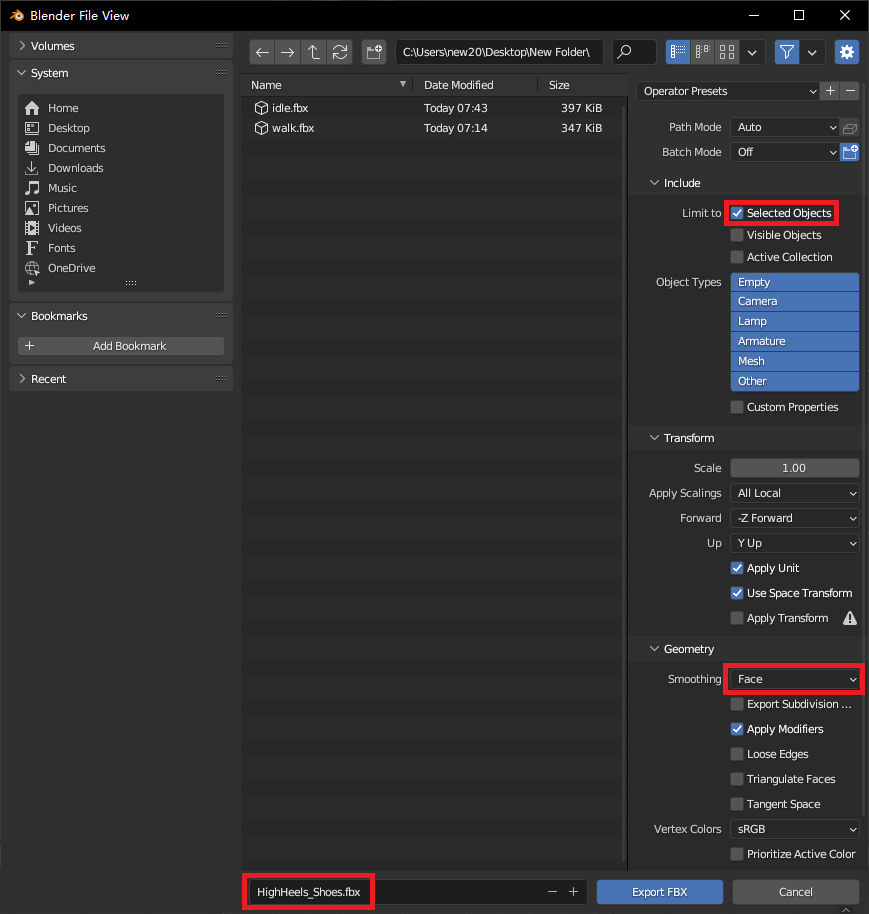

&nbsp;

* * *

&nbsp;

其他鞋 原理相同。

&nbsp;