2.7 **导入资产**（ **Practice** 文件夹仅用于练习工作流，第三章  操作时请用 **Slope_HighHeel_IK** 文件夹里的内容。）

&nbsp;

新建文件夹 **Practice**

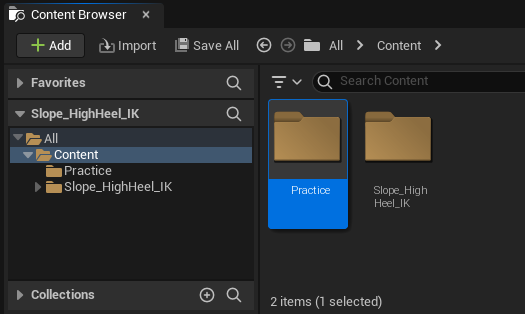

&nbsp;

拖拽文件到**UE**文件夹内。

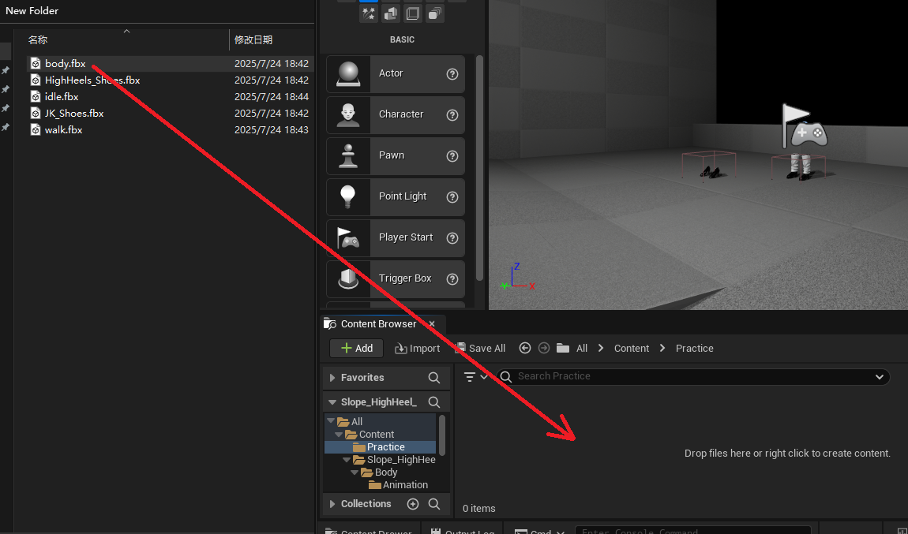

&nbsp;

&nbsp;

设置选项。

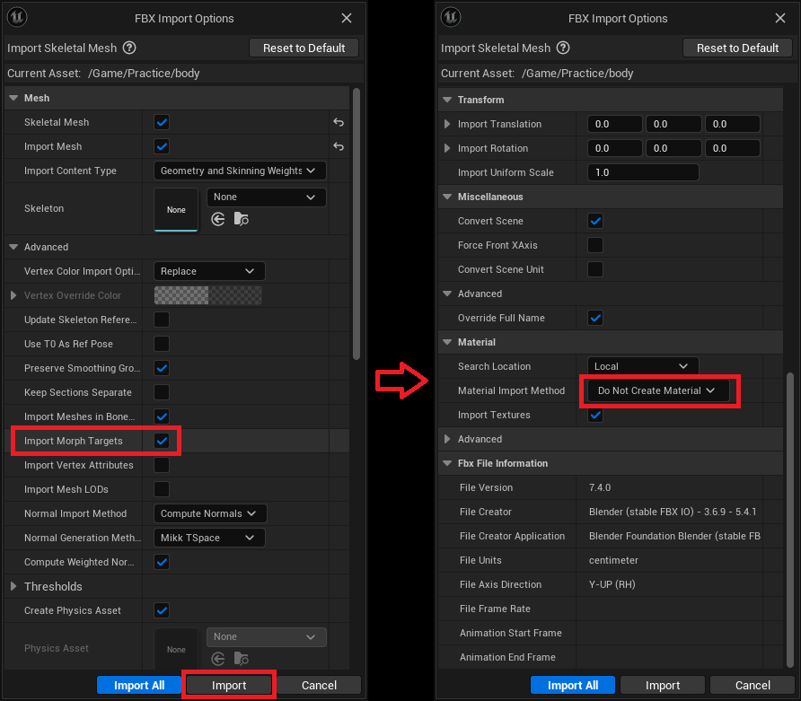

&nbsp;

&nbsp;

打开**body**，查看形态键是否生效。

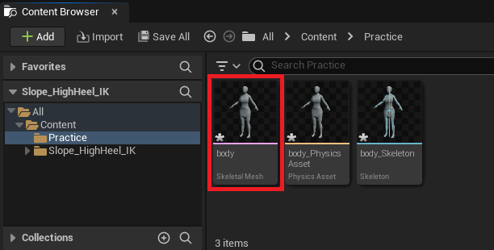

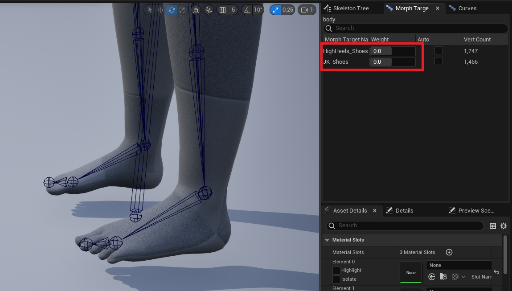

&nbsp;

* * *

&nbsp;

&nbsp;

打开 **body_Skeleton** 添加插槽。

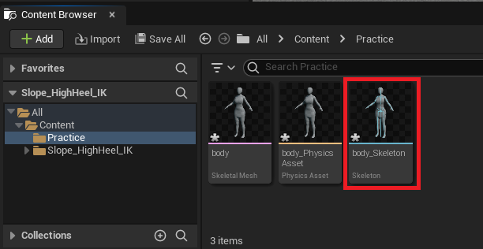

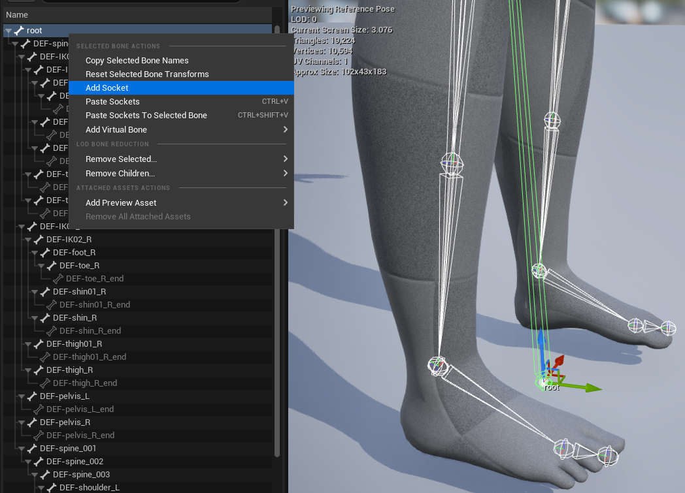

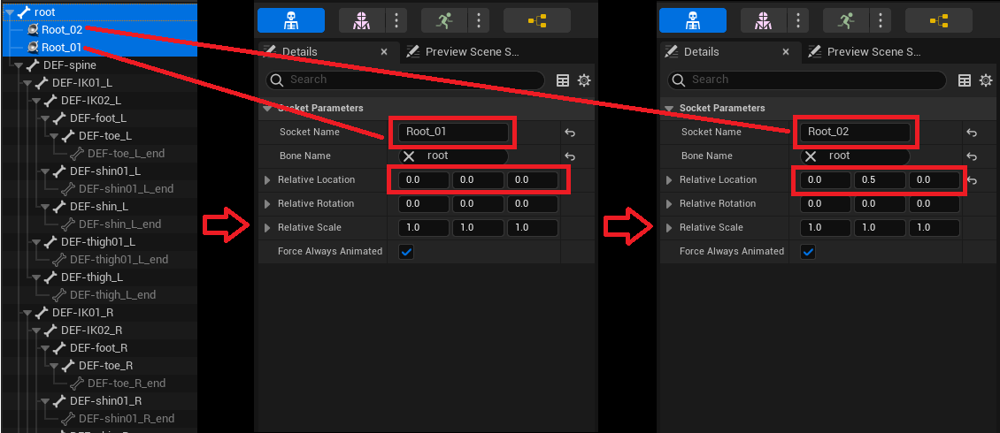

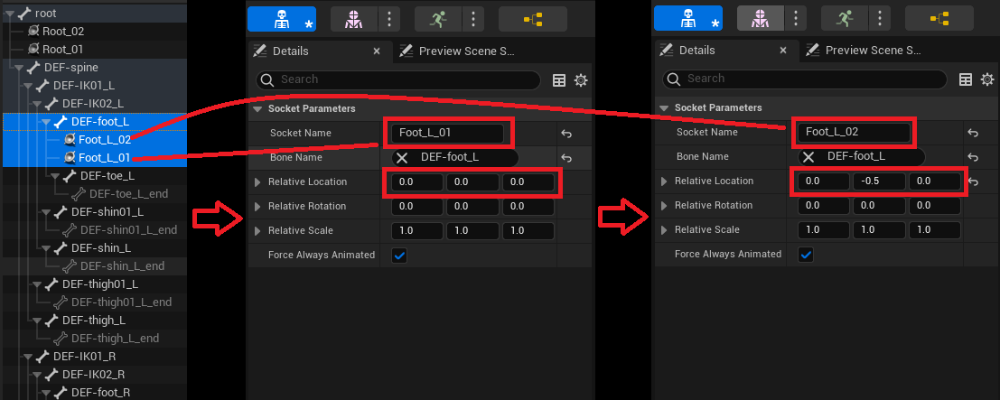

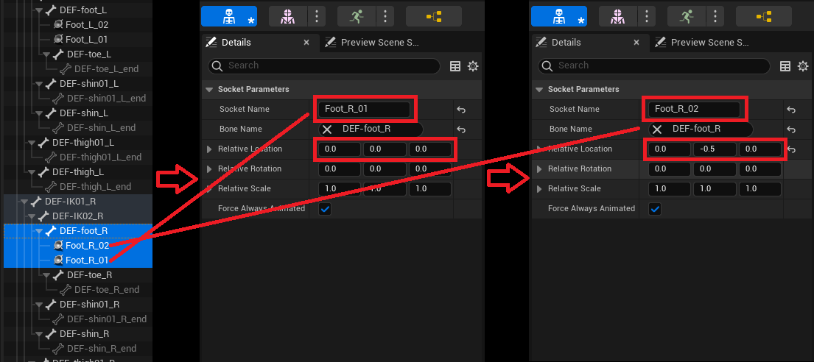

&nbsp;

* * *

&nbsp;

&nbsp;

导入动画文件。

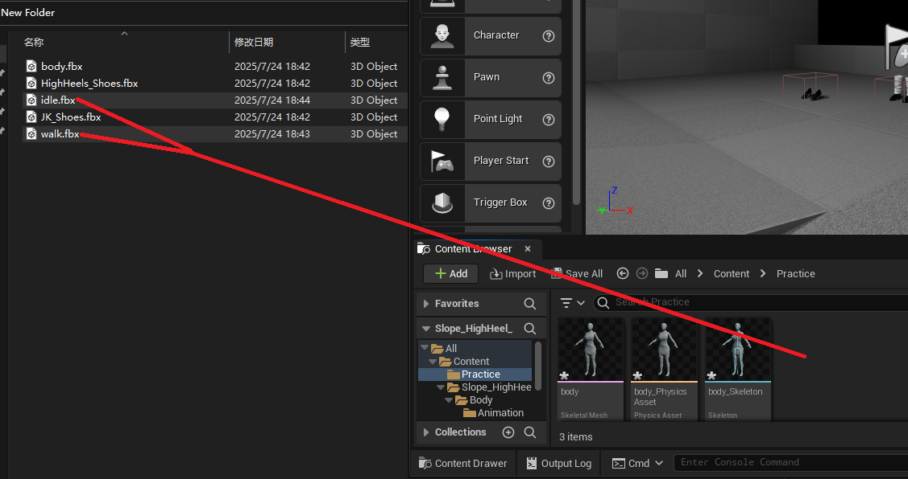

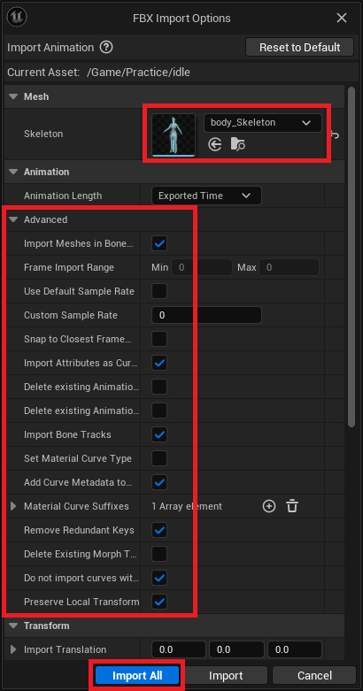

&nbsp;

&nbsp;

打开动画查看根运动是否生效。

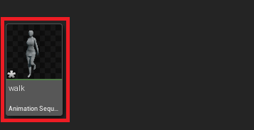

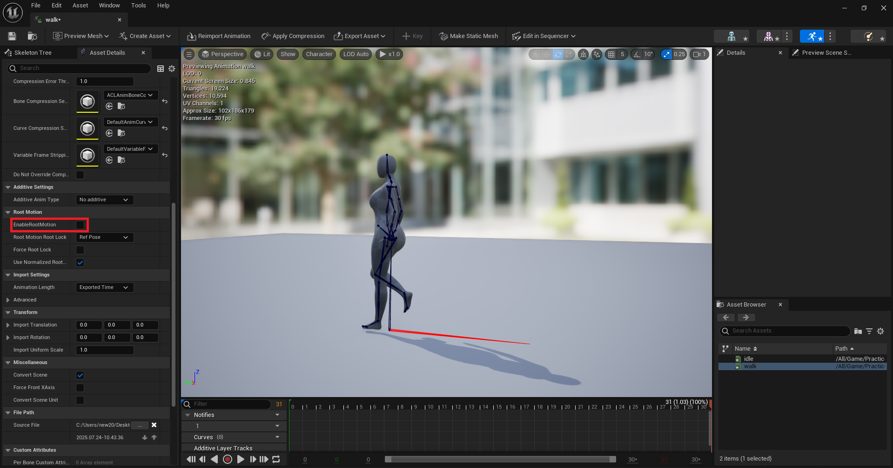

&nbsp;

* * *

&nbsp;

&nbsp;

导入鞋骨骼网格体。

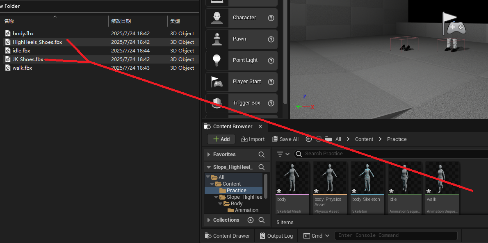

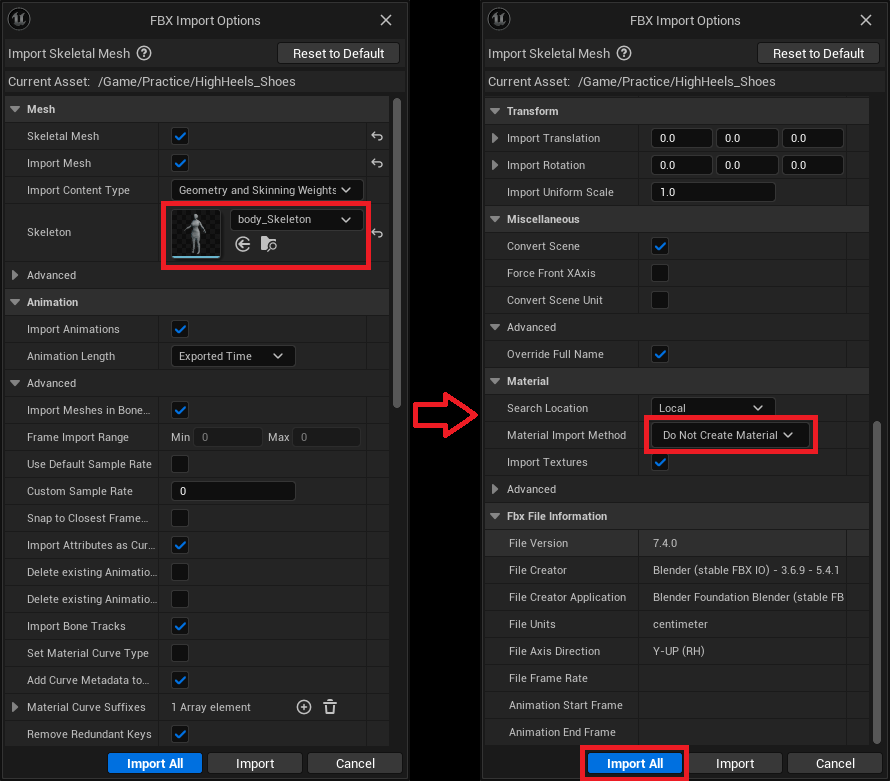

&nbsp;

&nbsp;

打开鞋 查看骨骼是否成功导入。

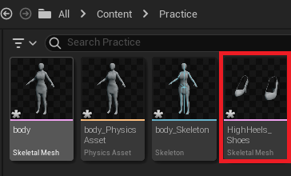

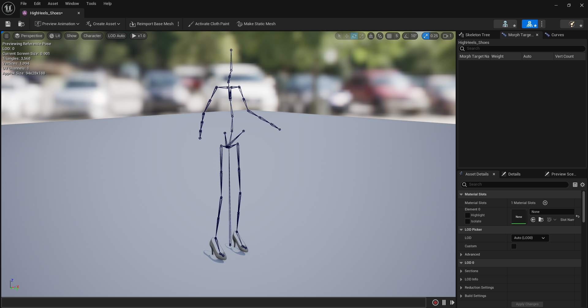

&nbsp;