2.3 烘焙动画（参考 3.blend）

&nbsp;

选择 **Rig** 骨骼，选择 walk 动画，帧率30帧，结束帧32帧。

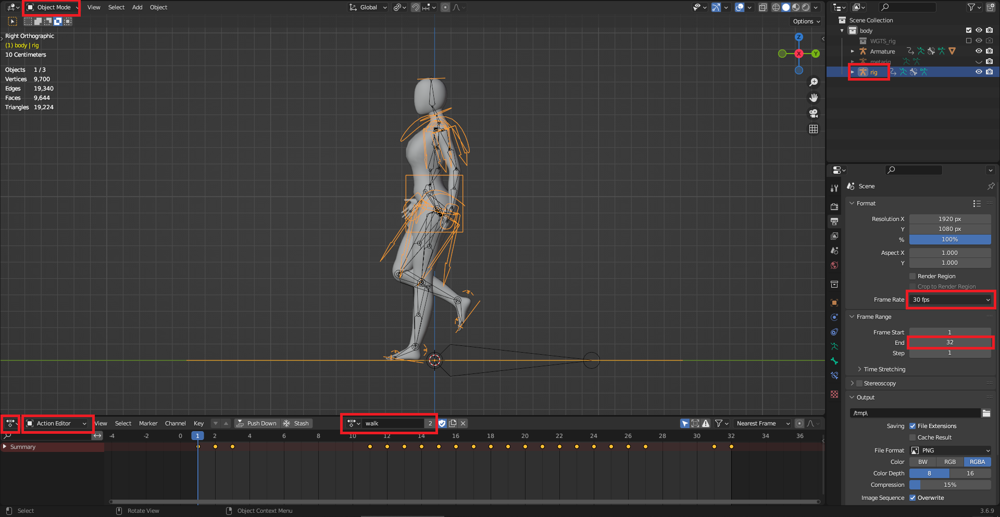

&nbsp;

&nbsp;

IK解算器选择  iTaSC，精度 0.0001   迭代 1000

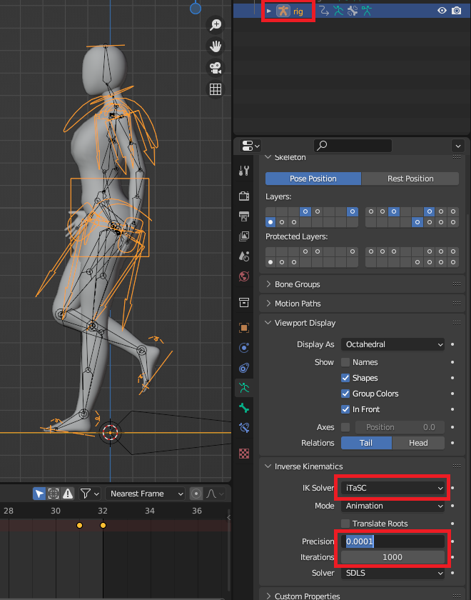

&nbsp;

&nbsp;

**Rig** 选择 iTaSC ，**Armature** 保持默认。

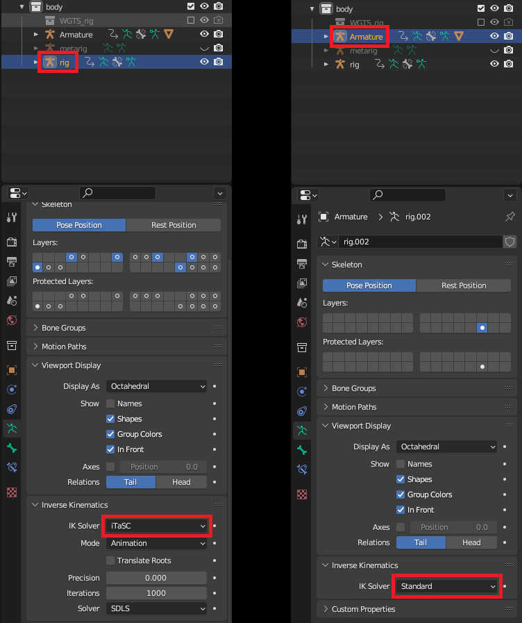

&nbsp;

&nbsp;

选择 **Armature** 骨骼，进入 姿态模式，按 `A` 全选。

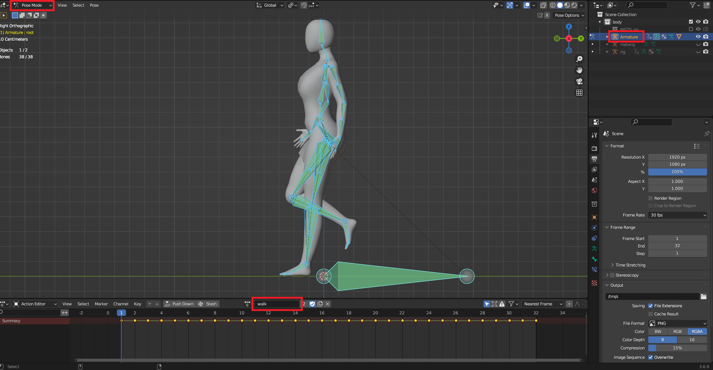

&nbsp;

&nbsp;

烘焙动画。

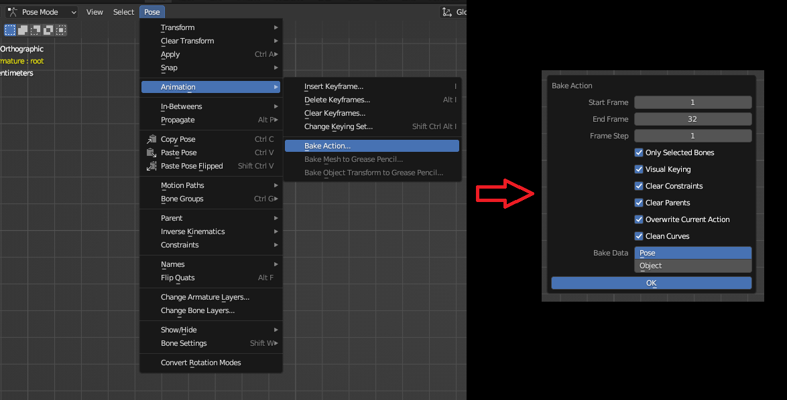

&nbsp;

&nbsp;

导出骨骼动画。

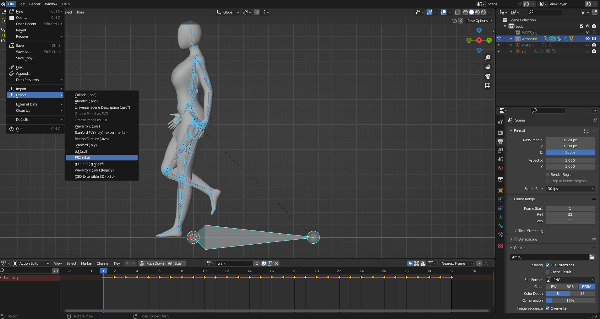

&nbsp;

&nbsp;

导出到你自己的文件夹。

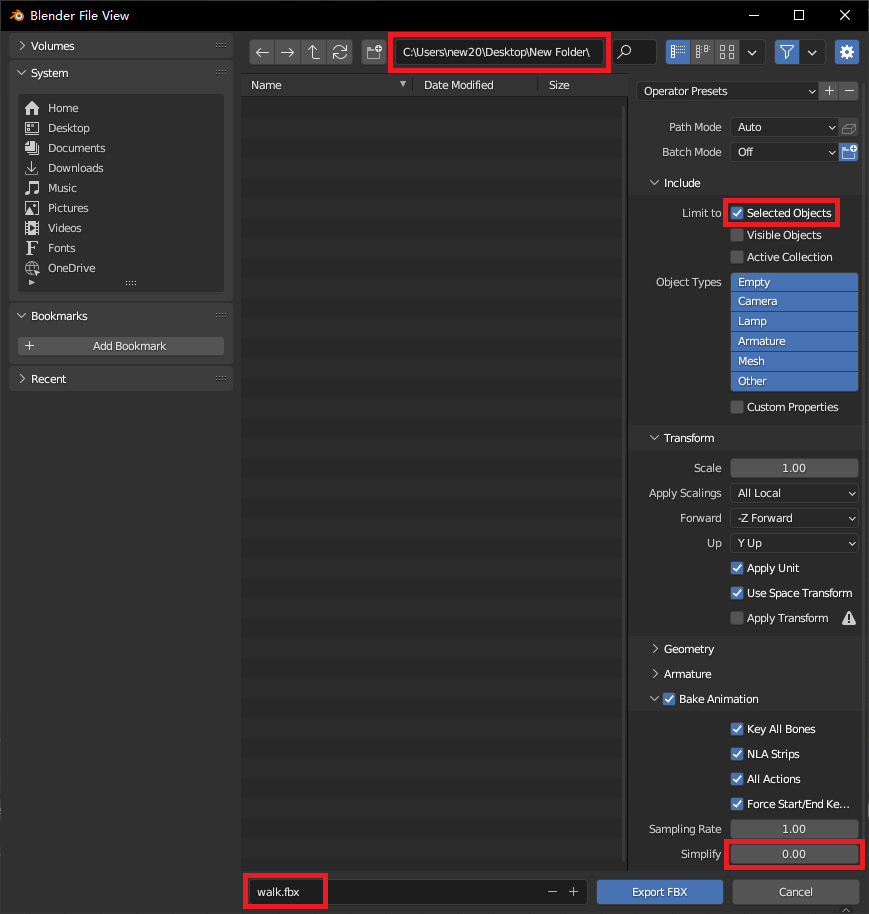

&nbsp;

* * *

&nbsp;

&nbsp;

重新打开 4.blende ，烘焙 idle 动画，同样的操作。

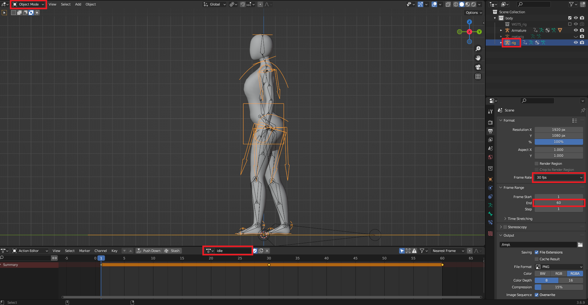

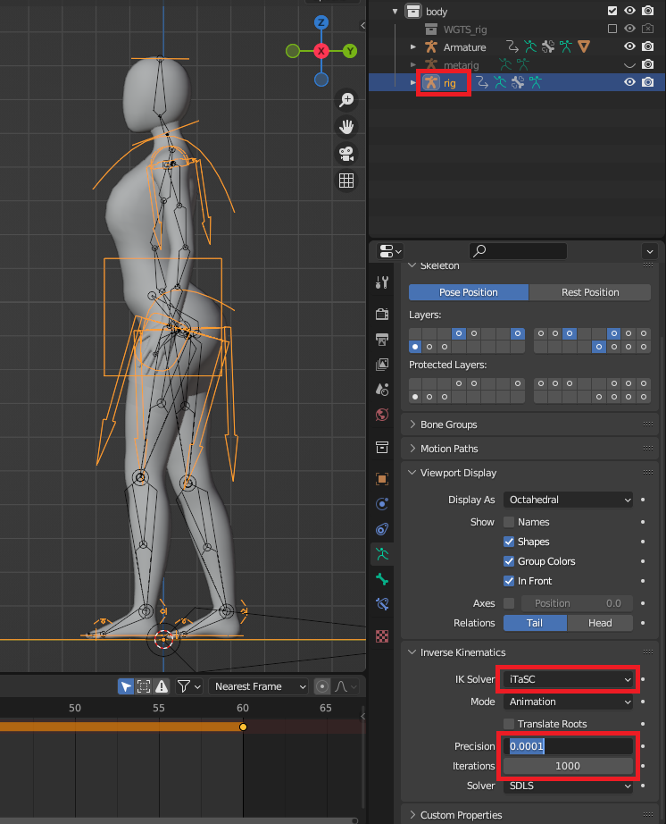

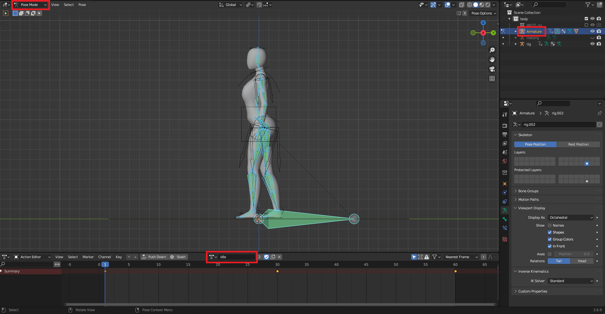

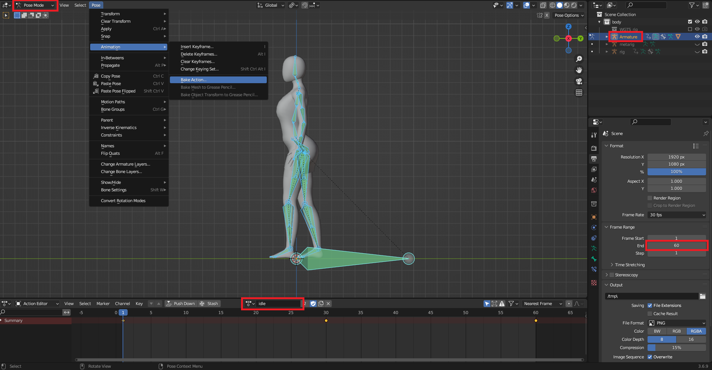

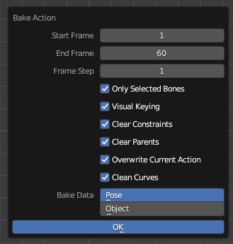

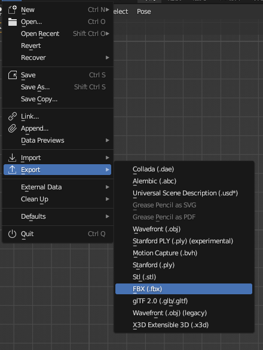

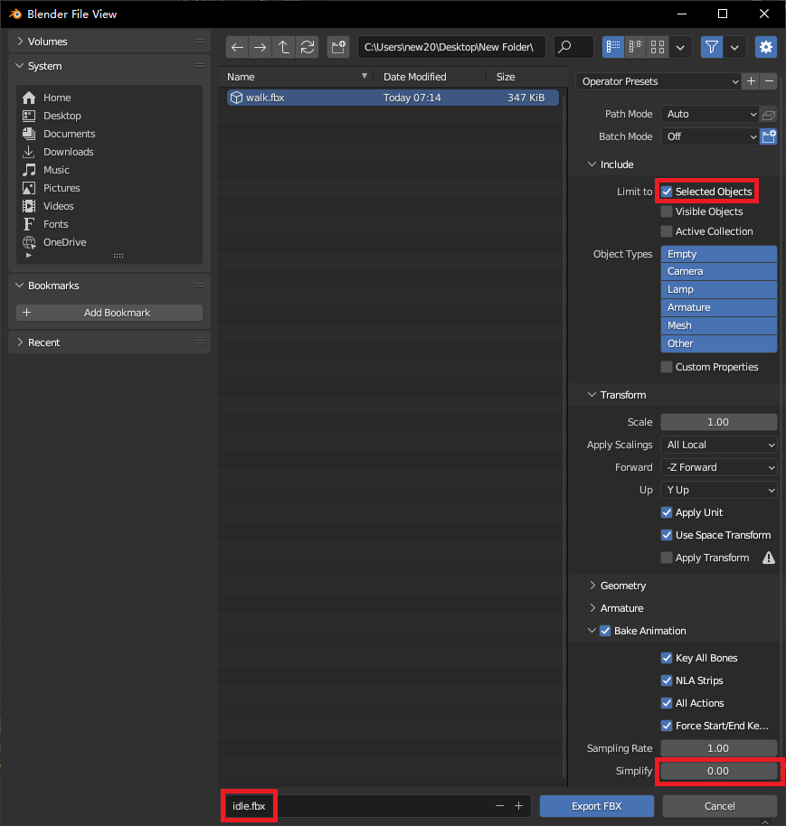

&nbsp;