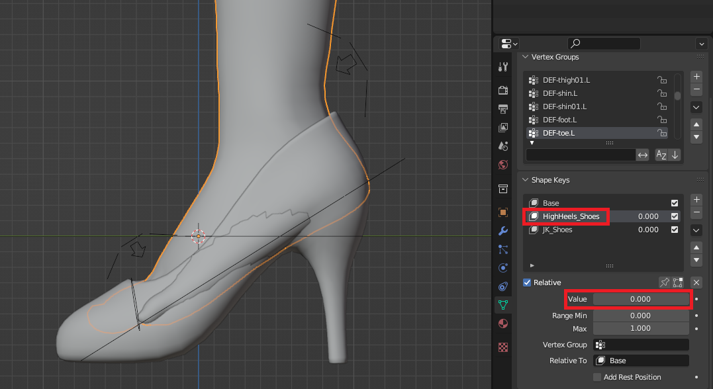
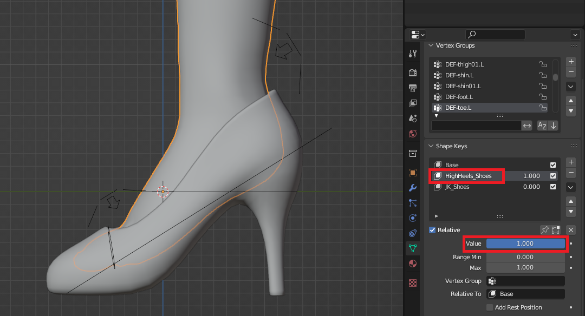
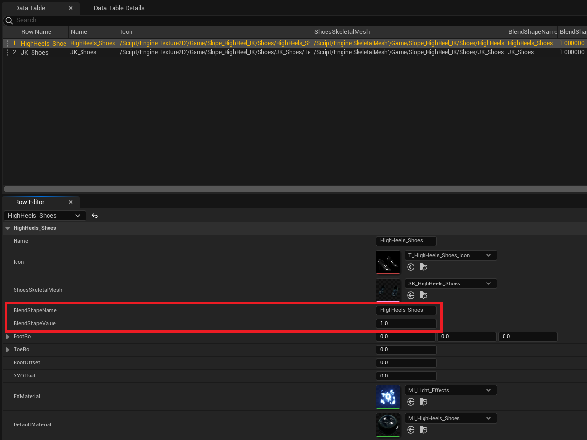
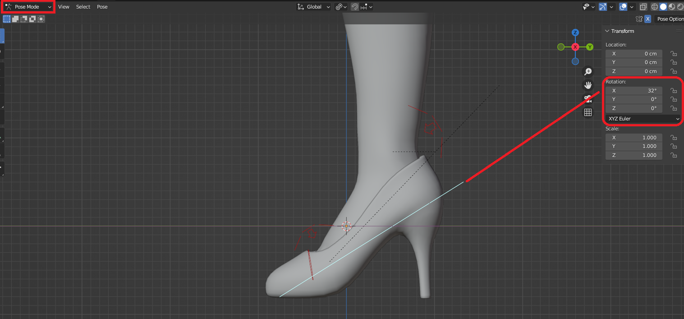

3.1 **数据表格**

&nbsp;

形态键：（参考 4.blend）

&nbsp;

* * *

&nbsp;

&nbsp;

**FootRo** 数值：（参考 4.blend）

&nbsp;

* * *

&nbsp;

&nbsp;

**ToeRo** 数值：（参考 4.blend）

**Toe**骨骼的轴向在UE里要反向填写。

&nbsp;

&nbsp;

数值是直接复制过去的，小数点后面几位会有误差，别忘了正数改成负数，负数改成正数。

&nbsp;

* * *

&nbsp;

&nbsp;

**RootOffset** 数值：

切换到你想要调试的鞋，如下图所示，先断开引脚尝试合适的数值，填写到表格里再连上引脚，表格里的数值需要重新开始游戏才能刷新。

&nbsp;

* * *

&nbsp;

&nbsp;

**XYOffset** 数值：

站在斜坡上，面向正下坡，如下图所示，先断开引脚尝试合适的数值，填写到表格里再连上引脚，表格里的数值需要重新开始游戏才能刷新。

&nbsp;